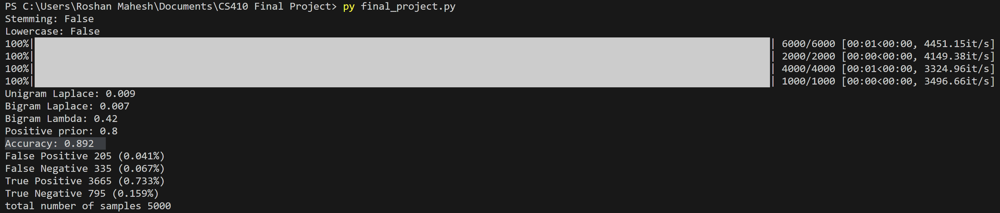

# Team -> Textual Tacticians

Roshan Mahesh (roshanm2), Jimmie Gann (jcgann2), Keyuan Chang (keyuanc2), Vedang Bhargava (vedangb2), Vaasay Farid (vfarid2)

# Topic Overview

We are going to do a sentiment analysis of movie reviews. The task is to look past the review rating and focus on the overarching theme (positive or negative) of the review. This is important for users who are deciding whether or not to watch a movie since the movie review rating that people give usually isn’t representative of their written thoughts of the movie. Additionally, most people just want to know whether a movie is good or not and don’t want to read extremely long reviews. Providing a sentiment analysis on movie reviews allows users to understand the population’s view on the movie without spending the time to read each review.

# Code Overview

The code comprises a Python script for sentiment analysis using a mixture model of a bigram and unigram Naive Bayes classification. The main function loads the data, runs the classifier, and computes the accuracies. The mixture model algorithm takes each bigram “bi” as a sequence of 2 consecutive words from either the training or development set. We take these pairs of words to compute the following probabilities for the bigram/unigram model: P(Type = Positive | Words) = (P(Type = Positive) / P(Words)) * ∑ P(Word Pair | Type = Positive) and P(Type = Negative | Words) = (P(Type = Negative) / P(Words)) * ∑ P(Word Pair | Type = Negative). Using these probabilities to compute the likelihood of a word or set of 2 words being either positive or negative, we then combine the bigram model and the unigram model into a mixture model with a parameter “lambda”, which controls how much emphasis to give to the unigram model and how much to the bigram model. This combination is computed with the following formula: (1 - lambda) * log[P(Y) * ∑ P(wi | Y)] + (lambda)*log[P(Y) * ∑ P(bi | Y)] where wi is each unigram word, and bi is each pair of bigram words. After this, we just compute the accuracies based on the positive/negative values that were already assigned to the movie review dataset.

# Instructions to Run Code

1. Set up an environment running Python 3.8
1. Install the following libraries using pip–install:
  - nltk
  - tqdm
  - reader
  - Collections
  - numpy
1. Clone repo to local machine and run the program by typing “python3 final_project.py”. You may have to run the program by typing “py final_project.py” if the first command doesn’t work.
1. Record results
1. To run the SOTA model (XLNet) for this IMDB dataset to compare with more complicated models with slightly higher accuracies than our model, there are two recommended ways:
  - Following the hugging face document instructions and importing the XLnet model.
  - Directly downloading the pre-trained model from the original paper repository on GitHub.

# Demo

[Video Link](https://drive.google.com/file/d/1V8BHa5C-lhphMyZNDSenwechZg3Uyb3L/view?usp=sharing)

You might have to download the video for better video quality. For some reason, viewing the video on Google Drive worsens the quality of the video.

# Results

- The results surpassed our goal of 80% by coming in at 89.2% accuracy. This was achieved on the Stanford Dataset.
- The IMDB Dataset turned out to be the same as the Stanford Dataset. Because of this, we only trained the model once.
- Overall, the expected hypothesis was achieved and surpassed when using the Stanford Data but we did not run it with the IMDB Data.
- Compared to similar but more complex models out there, our model is a fairly accurate one. The highest is ~7% higher than ours, shown in the following link: [IMDb Benchmark (Sentiment Analysis) | Papers With Code](https://paperswithcode.com/sota/sentiment-analysis-on-imdb)

# Dataset(s)

Publicly available Text-based datasets will be used to build this project. The Stanford Dataset, which is just the IMDb dataset, has thousands of positive and negative reviews. For this project, we collected 10,000 positive and 3,000 negative reviews, which were split into 5,000 development examples and 8,000 training examples.

[Stanford Data](https://ai.stanford.edu/~amaas/data/sentiment/)
[IMDB Dataset](https://www.kaggle.com/datasets/lakshmi25npathi/imdb-dataset-of-50k-movie-reviews)
